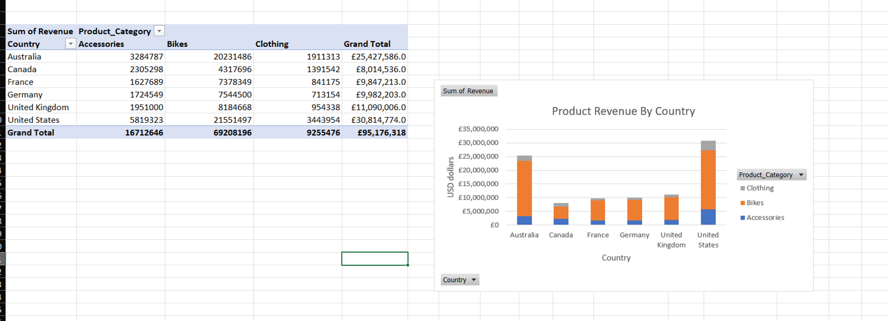
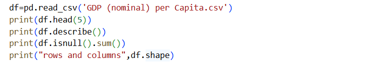
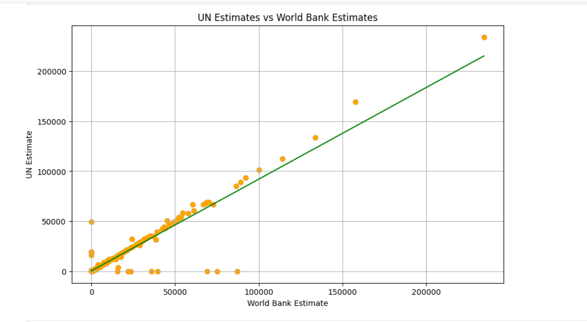
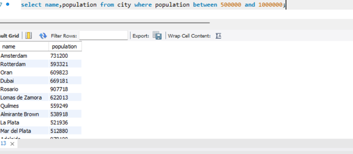
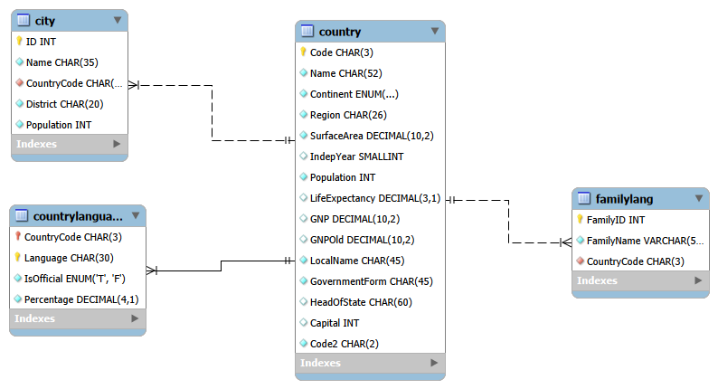
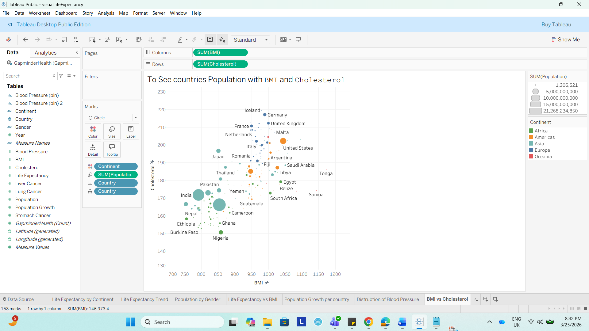
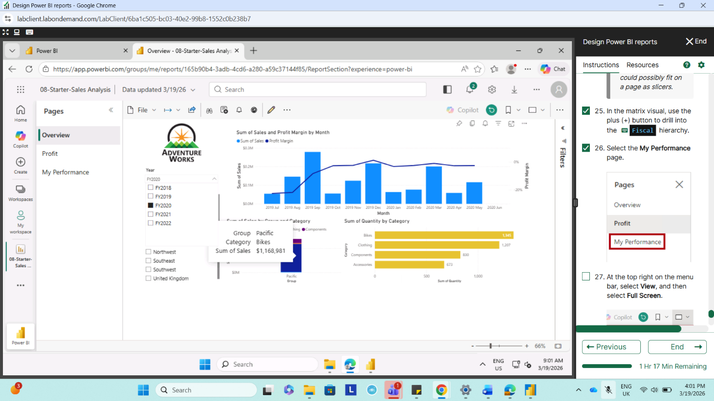

# Hi, I'm Yonas Gebre! 👋

### **Aspiring Data Analyst | Software Engineer**
Based in **Birmingham, UK**, I am a Computer Science and  graduate and former University Lecturer transitioning into the world of **Data Analytics**. I combine a deep background in software development and OOP with modern data technician training to build scalable, data-driven solutions.

---

##  About Me
- 🎓 **Background:** BSc in Computer Science and Engineering from Unity University.
- 🏫 **Past Life:** Assistant Lecturer (AI, OOP, Databases) and Team Leader for ERP development.
- 📊 **Currently:** Refining my skills in **Excel,PowerBI,Tableau,SQL, Microsoft Fabric, and Python** for data analysis.
- 🎯 **Future:** Looking for Junior Data Analyst or Data Engineering roles in Finance, Health, or Business.

---

### **Data & Analytics**
- **Analysis:** Python (Pandas, Matplotlib, Seaborn), MS Excel
- **Visualization:** Power BI, Tableau
- **Cloud & Databases:** Azure (Cosmos DB, Relational DB), SQL (PostgreSQL, MySQL)

### **Software Engineering**
- **Programming:** Java, Python, Golang, C, C++
- **Frontend:** React, Flutter, HTML/CSS, JavaScript
- **DevOps/Tools:** Git, GitHub, Linux, Scram

---
### 🛠️ My Tech Stack

<table>
  <tr>
    <td align="center" width="96">
      
       Excel
    </td>
    <td align="center" width="96">
      
       Power BI
    </td>
    <td align="center" width="96">
      
       Python
    </td>
  </tr>
</table>

---
## 📂 Projects

### 📈 **Data Analysis Portfolio**
#### **Excel** 
- Title: Sales performance analysis using Pivot Table and chart.
- The Dataset: Sourced from Kaggle [Retail Sales Dataset](https://www.kaggle.com/datasets/hamedahmadinia/global-bike-sales-dataset-2013-2023), containing over 110,000 records of customer purchases and regional sales.This dataset contains comprehensive retail information, including customer infromation, location, and categorized product details for bikes, clothing, and accessories. It also includes financial metrics like unit costs, revenue, and profit.
- What I did: I used Excel Pivot Tables to summarize revenue and created a Stacked Column Chart to compare sales across different countries and product categories
-  Pivot table and charts helped to identify which items the business should focus on selling in specific global markets to increase total profit.
- Organisation sectors: Online Retailer or Supermarket
- Why this task is important for them:They use this data to track which products sell best and which countries are the most profitable. It helps managers decide where to spend marketing money and how much stock to order for different regions.
#### **Python for Data Analysis** 
- Title: Worldwide GDP Per Capita Data Analysis Using Python
- The dataset:Sourced from Kaggle [GDP Per Capita Income by Country](https://www.kaggle.com/datasets/rajkumarpandey02/gdp-in-usd-per-capita-income-by-country).This dataset tracks the economic wealth of 223 countries using estimates from the IMF, World Bank, and United Nations.It is used to compare national economic health and standard of living across different global regions.
- What I Did: I used Python to clean and transform datasets by fixing missing values and changing to appropriate datatype. I performed an Exploratory Data Analysis (EDA) using Matplotlib and Seaborn to create visual charts and heatmaps.
- This code use *Pandas* library to import data and provides a summary of the data's size,it also shows the data is clean before analysis.
- 
- 
- Python notebooks from data cleaning to viuslizing the dataset.[Notebook Data CLeaning and Visualising](Week6day4Visual.ipynb)
- Organisation sectors: International Investment Bank or Economic Research Institute.
- Why this task is important for them:These organisations use this data to evaluate the economic health and growth potential of different countries before making major investment decisions. By comparing wealth data from multiple sources like the IMF and World Bank, they can accurately assess financial risks and identify the best global markets for business expansion.
#### **SQL for Data Analysis** 
- Title: Global Population and Economic analysis: SQL
- The Dataset: This is the standard relational database sample provided by the MySQL team.[MySQL Documentation - World Databas](https://dev.mysql.com/doc/index-other.html).It contains country,city and city Lanagauge tables.
- What I did:I developed a set of SQL queries to extract and analyze global demographic data in MySQL Workbench. I used SQL techniques, including JOINs to combine country and city data, Subquerie, and Aggregate Functions to calculate average populations.
- The sample query to show citites with population between 500000 and 1000000 
- [SQL Scripts](World_scipt.sql)
- The database design .
- Organisation sectors: Global Shipping Company (e.g.DHL) or International Retailer.
- Why this is important:A shipping company would use these SQL queries to find the biggest cities and the wealthiest countries to decide where to build their next delivery centers. These scripts allow them to quickly sort through thousands of locations to find the most profitable places to expand their business.
####  **Tableau** 
- Title: Global Health Insights(BMI and Cholesterol) Using Tableau
- The Dataset: Sourced from Gapminder, focusing on global health metrics across different continents.
- What I did: I built a Bubble Chart comparing BMI vs. Cholesterol levels.I Used visual cues like Color (for Continents) and Size (for Population) to show health trends and regional patterns.
- Organisation sectors: Public Health Agencies (like the NHS or WHO).
- Why this is important:: This analysis helps the World Health Organization (WHO) decide where to send health grants and equipments. Helps for NHS, to identify risk groups before they get sick and prepare health plans.
#### **Power BI Dashboards** 
- Title: Sales Reports
- The dataset: Adventure works dataset prepared by microsoft.
- [Power BI dashboard Developed using Power BI Desktop](https://app.powerbi.com/links/edDr6ca--a?ctid=3ea7c128-c601-4479-a003-e14d00c0b5cb&pbi_source=linkShare)
- Title:Sales Performance Dashboard Using Microsoft Power BI
- What I did: Developed an Interactive dashboard to analyse sales,profit and product perfomance.I used Sync Slicers and filters.
- 
- Organisation sectors: Retail and E-commerce comapnies,Manufactruing and supply chain business.
- Why this is important:Organisations can use this dashboard to monitor sales performance, track profit margins, and identify top-performing products and regions in real time.
It enables data-driven decision-making by highlighting trends, improving forecasting, and helping businesses optimise pricing, inventory, and sales strategies.
###  [Sabisa ERP System](https://github.com/haftomdesbele/SabisaBarAndRestaurant)
A fully functional, integrated ERP system designed for enterprise management.
* **Technologies:** Java, MySQL, iText.
* **Impact:** Automated HRM, Inventory, and Financial Services for business operations.

###  [Network Administrator Tool]
Developed a network monitoring solution using Java and socket programming.
* Enables real-time monitoring, file sharing, and remote control over a LAN.

## Get in touch:
- 📧 **Email:** [Yonas.desbelegebre@gmail.com](mailto:Yonas.desbelegebre@gmail.com)
- 📍 **Location:** Birmingham, West Midlands (Open to Relocation)

"I am a lifelong learner passionate about solving real-world problems through data-driven decision making."
